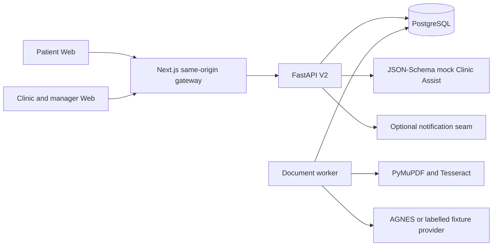

# ClinicPass V2 architecture and safety model

ClinicPass is a monorepo containing a Next.js 16 patient/staff Web app, FastAPI API and worker, PostgreSQL, and a schema-validating mock Clinic Assist receiver. Render co-locates API and worker under the migration-running supervisor; local Compose can run them separately.

## Authoritative V2 model

The legacy `cases.rules` and document JSON remain readable for rollback compatibility, but normalized V2 records are authoritative when `CLINICPASS_V2_ENABLED=true`:

- immutable `ReferenceDataRelease` versions own payer organisations, eligibility contracts, package versions, procedures and coverage, panel rules, and billing rules;
- reusable patient profiles hold masked/encrypted identity and contact/demographic fields;
- `general-health@1.0` and `occupational-health@1.0` submissions reuse and explicitly confirm profile fields;
- field assertions bind each extracted value to a document, page, evidence IDs, bounding boxes, provider, support state, and validation errors;
- corrections preserve original values and invalidate eligibility;
- evaluations store ruleset/reference versions, canonical input hash, time, outcome, freshness, and 11 finding records;
- override requests, manager overrides, review decisions, individual on-site attestations, integration exports, benchmarks, metrics, and chained audit events are independent records.

## Evaluation and approval

The deterministic rules are `IDENTITY_MATCH`, `ISSUER_RECOGNISED`, `DOCUMENT_VALID_ON_VISIT_DATE`, `ORGANISATION_CODE_VALID`, `PACKAGE_CODE_VALID`, `PACKAGE_ACTIVE_ON_VISIT_DATE`, `CLINIC_ON_PANEL`, `REQUESTED_SERVICES_COVERED`, `SUPPORTING_DOCUMENTS_COMPLETE`, `BILLING_ROUTE_RESOLVED`, and `DOCUMENT_CONFLICT_FREE`.

Outcomes are `PROVISIONALLY_ELIGIBLE`, `REVIEW_REQUIRED`, or `BLOCKED`; none guarantees coverage. Profile/document/questionnaire edits, removal, retry, correction, or reference activation marks earlier evaluations stale. Approval runs a server-side hash comparison and fresh evaluation in the decision path, requires `READY_FOR_REVIEW`, clean/complete documents, and a manager override for every remaining REVIEW/FAIL finding. Approval from `NEEDS_ACTION` and the legacy inline `override_failures` path are rejected.

After approval, staff create separate `IDENTITY_DOCUMENT`, `ECARD`, and `ORIGINAL_SUPPORTING_DOCUMENTS` attestations. Only the third distinct record transitions the case to `CHECKED_IN`.

## Evidence and extraction boundary

Uploads are parsed and scanned before entering the worker queue. AGNES receives normalized page images plus OCR evidence, but never profile questionnaire or medical-history responses. Unknown evidence IDs are dropped. Unsupported and conflicting critical facts are explicit; no uncalibrated confidence percentage is shown. The staff workspace retrieves original bytes through a clinic/tenant-authorized no-store route and displays field citations beside the document.

## Export and rollback

The `2.0.0` export includes case, masked patient profile, visit, questionnaire, eligibility, requested services, documents/assertions, review, corrections, overrides, and on-site checks. Both sides bind the payload to `Idempotency-Key`; invalid or failed delivery stays retryable from `CHECKED_IN`.

Migration `0005_clinicpass_v2` is additive and has a downgrade. Deployment can disable `CLINICPASS_V2_ENABLED` while retaining V2 tables, or roll code back to the checkpoint branch described in the README. Existing terminal history is retained; non-terminal legacy work is placed in `NEEDS_ACTION` instead of being assigned an invented passing evaluation.
