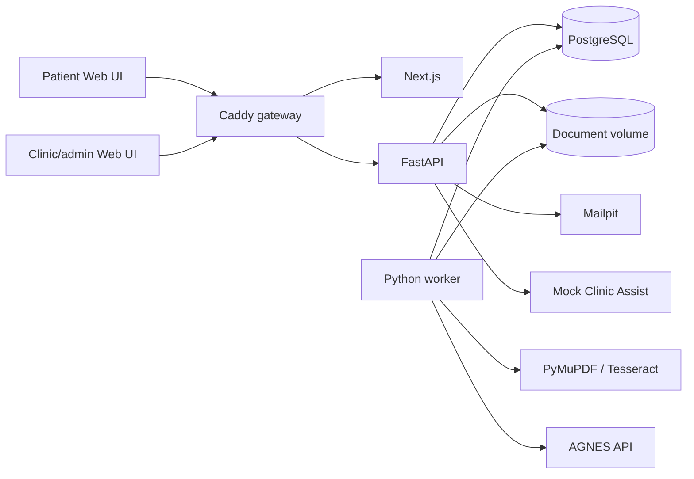

# Architecture and safety model

ClinicPass is one deployable monorepo with separately scalable Web, API, and worker processes.

## Trust and decision boundary

1. Upload validation rejects unsupported, unreadable, password-protected, oversized, or over-six-page documents.
2. PDFs are rendered page by page; photos and screenshots are EXIF-corrected and normalized to private JPEG data URLs. OCR separately creates page/region evidence records.
3. The configured AI provider classifies the visual document and extracts structured administrative fields. Live mode sends both images and OCR evidence through constrained AGNES tool calls; fixture mode is visibly labelled.
4. Pydantic rejects malformed results and unknown evidence IDs are dropped.
5. Six versioned, deterministic checks calculate readiness: identity detail, validity, clinic/location, organisation/package code, supporting documents, and billing completeness.
6. Staff inspect source evidence, request information, or approve. A failing check requires an explicit recorded override.
7. Identity, e-card, and original-document confirmation can only be recorded on site before export.
8. Submission issues a patient-visible queue number. The patient page polls the same case record; staff approval changes the destination to Registration Counter 2, and check-in changes it to Consultation Room 3.

No AI output directly approves a case. ClinicPass does not diagnose, make clinical decisions, remotely verify identity, promise coverage, or replace a clinic’s source systems.

## State model

Documents can be processed while a case remains `DRAFT`. Submission then follows:

`DRAFT → SUBMITTED → PROCESSING → NEEDS_ACTION | READY_FOR_REVIEW → APPROVED_FOR_CHECK_IN → CHECKED_IN → EXPORTED → COMPLETED`

The parallel patient queue state is `NOT_ISSUED → WAITING_FOR_REVIEW → PROCEED_TO_REGISTRATION → CALLED_TO_ROOM`. Queue changes are timestamped and returned to both patient and staff surfaces.

A patient who declares `no` documents or `unsure` may submit without an upload; the supporting-document check becomes `REVIEW` for staff confirmation. A patient who declares `yes` must upload a non-failed document.

`CANCELLED` is terminal. API guards reject invalid transitions, and every consequential action appends an audit event.

## Provider seams

The worker isolates OCR and AI providers. `AI_PROVIDER=fixture` supports deterministic CI; `AI_PROVIDER=agnes` requires `AGNES_API_KEY` and fails visibly if unavailable. AGNES uses the documented OpenAI-compatible `POST /v1/chat/completions` interface with forced classification and extraction tool calls. The configured endpoint was capability-tested with a private data URL, so localhost documents do not need public hosting. See [AGNES 2.0 Flash](https://agnes-ai.com/en/docs/agnes-20-flash).

The local demo uses a Docker volume for document objects, SMTP to Mailpit, and a separate mock Clinic Assist HTTP service. These are narrow seams for a future managed object store, notification service, and real clinic adapter.
